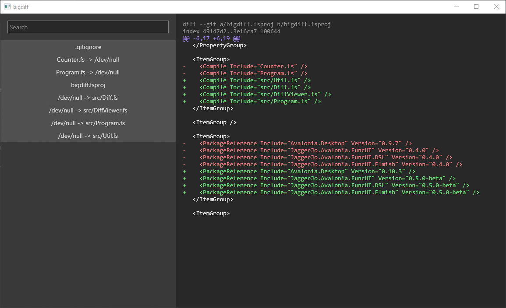

# bigdiff

Allows viewing big git diffs in a graphical editor.




## Usage

```
git diff 5456ebc bd7b21c | bigdiff
```

## Installation

### Windows

Run the following in powershell (you may need to allow executing external code):

```powershell
iwr https://raw.githubusercontent.com/fourtf/bigdiff/main/scripts/install-win-x64.ps1 | iex
```
### Linux

Run the following in a terminal compatible with sh:

```sh
wget https://raw.githubusercontent.com/fourtf/bigdiff/main/scripts/install-linux-x64.sh | sh
```

### macOS

TODO
